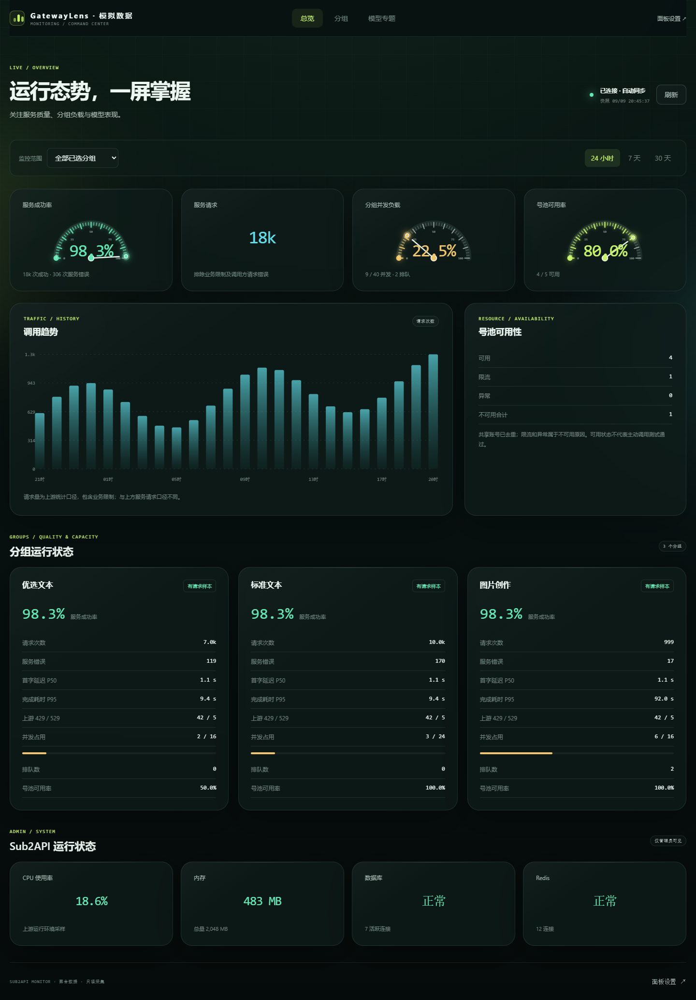
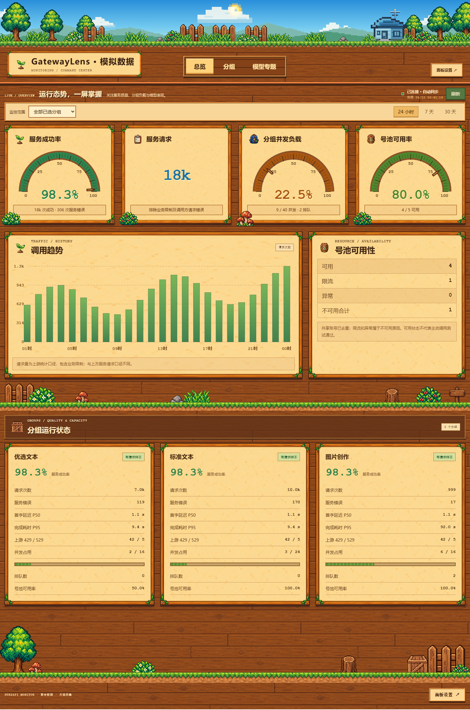
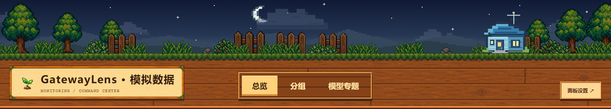

# GatewayLens

[MIT](LICENSE) · [架构](CONTRIBUTING.md#架构与目录) · [贡献指南](CONTRIBUTING.md) · [安全说明](SECURITY.md)

独立部署的 Sub2API 监控面板。网页输入站点地址和全局管理员 API Key，选择需要监控的分组，即可使用总览、分组和模型专题三个视图。提供默认深色和像素风两套主题，以及仪表盘、容量条、趋势图和号池警报。像素风的天空、日月、流云和小屋灯光随访问者当地时间变化。

界面使用中文，当前适合单实例自托管。以下截图来自本地模拟数据。



<details>
<summary>像素风主题</summary>



夜间会出现月亮、星空和小屋窗灯：



</details>

## Docker 一键启动

获取本仓库后，在项目目录执行：

```sh
bash scripts/deploy.sh
```

自动构建并启动服务，更新已有实例时自动备份。宿主机需要 Docker Engine、Docker Compose（支持 `up --wait`）和 Bash，无需安装 Node.js。默认监听 `127.0.0.1:8787`；支持已有 HTTPS 代理，也支持一个容器直接提供 HTTPS，详见下方的[部署与回滚](#部署与回滚)。

## 本地开发

要求 Node.js 22 或更新版本，无第三方运行依赖。

```powershell
npm ci
npm run check
npm start
```

访问 `http://127.0.0.1:8787`。第一次打开进入初始化页，使用控制台提示的数据目录中的 `setup-code` 文件，并设置至少 12 位的面板管理密码。控制台只输出初始化码文件位置，不输出码值。

默认数据目录是当前用户目录下 `.gpt-kanban`；可用 `KANBAN_DATA_DIR` 指向其他源码目录外的位置。管理员 Key 采用 AES-256-GCM 加密；加密密钥和配置文件都属于部署私有数据，不能提交、发布或放入镜像。Linux 目录权限为 700、文件权限为 600；Windows 应使用仅服务账户可访问的目录 ACL。

## 接入流程

1. 创建面板管理账户。
2. 输入 Sub2API 站点地址和其全局管理员 API Key，测试并保存连接。地址可包含安装子路径或 `/api/v1`。
3. 勾选分组，调整展示名称与顺序，选择模块。
4. 可选：配置图片模型名称，每行一个精确名称。
5. 保存展示设置后，默认允许游客直接查看所选分组的聚合数据，无需登录。取消“允许访客查看”可改为仅管理员查看；管理设置始终需要登录。
6. 可选：在“主动质量探测”中选择一个已展示分组、模型、请求路径和探测间隔，并填入绑定该分组的普通 API Key。保存后可按计划验证真实模型响应，也可手动立即探测。
7. 可选：在后台顶部“站点文案”中单独保存站点名称、总览主标题和副标题。

首次连接和更换站点后都需要选择分组并保存，才会向游客提供监控数据。更换站点会清空分组选择，并恢复默认开启的访客选项。同一站点更新 Key 可以保留展示配置；升级不会修改已有实例的公开选择。Key 永不通过设置接口回传。修改密码会使其他会话失效。

## 页面与数据

| 页面     | 入口        | 内容                                                         |
| -------- | ----------- | ------------------------------------------------------------ |
| 总览     | `/`         | 服务质量、分组并发、号池、请求趋势；管理员另可看系统采样     |
| 分组     | `/groups`   | 各组成功率、首字延迟、P95、并发、排队和可用率                |
| 模型专题 | `/models`   | 渠道监控 V2 的模型请求质量；支持图片模型筛选                 |
| 设置     | `/settings` | 初始化、登录、站点文案、连接、分组、模块、主动探测和密码管理 |

总览按 Sub2API Ops 服务请求口径剔除业务限制与调用方请求错误；趋势图采用吞吐接口的原始请求次数。模型专题使用渠道监控 V2 自身的错误排除口径，界面分别说明，不混合计算。没有样本、功能未启用、接口不支持和请求失败分别表示，不当作零值或健康状态。

共享账号按 ID 在后端去重，仅发布聚合结果。分组并发是共享资源占用，不能当作图片任务数；图片请求次数也不等于实际生成张数。P95 不跨组求平均。系统资源是上游返回的运行环境采样，不承诺为宿主机指标。

## 本地模拟预览

```powershell
npm run demo
```

此命令只启动本机模拟 Sub2API 与面板，数据存入系统临时目录，不连接生产。控制台返回模拟站点 URL。测试初始化码为 `demo-setup-code-local-only`，模拟管理员 Key 为 `demo-admin-key-not-production`；这两个字符串仅对模拟服务有效。停止进程后模拟数据源即停止。

## 站点文案与主题

登录 `/settings`，顶部“站点文案”可独立修改以下内容：

| 字段       | 显示位置                     | 长度限制 |
| ---------- | ---------------------------- | -------- |
| 站点名称   | 各页面顶部品牌与浏览器标签页 | 1–60     |
| 总览主标题 | 总览顶部                     | 1–80     |
| 总览副标题 | 总览主标题下方               | 1–160    |

三项均按纯文本显示，保存后刷新即可查看；监控页也会在下一次正常轮询时更新。文案属于公开站点信息，登录页可以显示站点名称。数据源未连接或离线时仍可修改，连接或分组更新不会重置文案。

“外观与皮肤”提供默认深色和像素风主题，选择保存在当前浏览器中。像素风使用当地时间呈现清晨、白天、傍晚和夜间，云、日月与窗灯随时间变化；这是装饰效果，不使用定位或真实天文日出时间。

## 部署与回滚

`compose.yaml` 默认只绑定宿主机回环地址。使用 HTTPS 时设置 `KANBAN_PUBLIC_ORIGIN` 为浏览器访问的完整 origin，以启用安全 Cookie 和来源校验。镜像支持在 ARM64 或 AMD64 宿主机上原生构建。

```sh
docker compose config --quiet
docker compose build runtime-command-center
docker compose up -d --no-deps --wait runtime-command-center
docker compose exec runtime-command-center cat /data/setup-code
```

Sub2API 地址必须从面板所在的容器可达；容器里的 `127.0.0.1` 指向该容器自己。只有确实需要内网明文 HTTP 时才设置 `KANBAN_ALLOW_HTTP=true`；默认 HTTPS 证书校验始终启用，上游重定向不会携带 Key 跟随。

更新前完整备份部署私有数据卷（包含加密密钥）和旧镜像；只备份 `settings.json` 无法恢复 Key。重建或重启面板会使内存登录会话失效，需要重新登录。

### 独立 HTTPS 容器

复制 `.env.example` 为 `.env`，按自己的域名、证书目录和空闲端口填写：

```dotenv
COMPOSE_FILE=compose.yaml:compose.tls.yaml
KANBAN_BIND_ADDRESS=0.0.0.0
KANBAN_PUBLISH_PORT=8443
KANBAN_PUBLIC_ORIGIN=https://dashboard.example.com:8443
KANBAN_TLS_DIR=/etc/sub2api-monitor/tls
```

证书目录包含 `fullchain.pem` 和 `privkey.pem`，只读挂载到容器，UID/GID 1000 需要有读取权限。证书放在源码目录外，防火墙和 NAT 按需开放所选 TCP 端口。`KANBAN_PUBLIC_ORIGIN` 必须与浏览器地址一致，否则管理写请求会拒绝。

然后运行 `bash scripts/deploy.sh`。健康检查会使用实际 HTTPS 协议并校验证书。证书续期后执行 `docker compose restart --no-deps runtime-command-center`，再确认健康状态。已有 Nginx 可参考 [代理配置](deploy/nginx/runtime-command-center.conf)；原生 Node 部署可参考 [systemd 示例](deploy/systemd/runtime-command-center.service)。

### 状态检查与备份

```sh
docker compose ps
docker compose exec -T runtime-command-center node server/healthcheck.mjs
```

部署脚本将私有备份放在 `$HOME/.local/state/sub2api-monitor/backups`；环境变量 `KANBAN_BACKUP_DIR` 可指定其他源码目录外的位置。备份包含数据卷、加密密钥、初始化码、解析后的 Compose 配置、旧镜像标签和 SHA-256 清单，不应公开。

需要恢复旧镜像时执行：

```sh
bash scripts/rollback.sh /private/backup/directory
```

回滚保留当前数据卷。数据误删时先停止面板，再把已校验的 `data.tar.gz` 恢复到对应卷并保持 UID/GID 1000；不要覆盖正在写入的卷。正式实例不要执行 `down -v`。系统级备份还应包含证书。

### 环境配置

| 变量                                          | 默认值 / 用途                              |
| --------------------------------------------- | ------------------------------------------ |
| `KANBAN_BIND_ADDRESS` / `KANBAN_PUBLISH_PORT` | `127.0.0.1` / `8787`，宿主机监听地址与端口 |
| `KANBAN_PUBLIC_ORIGIN`                        | 外部完整 origin；HTTPS 部署时填写          |
| `KANBAN_ALLOW_HTTP`                           | `false`，是否允许内网 HTTP 上游            |
| `KANBAN_CACHE_MS`                             | `30000`，快照缓存时间                      |
| `KANBAN_REQUEST_TIMEOUT_MS`                   | `8000`，上游请求时限，范围 1000–30000      |
| `KANBAN_SNAPSHOT_TIMEOUT_MS`                  | `40000`，快照总时限，范围 1000–40000       |
| `KANBAN_DATA_DIR`                             | 原生 Node 的数据目录；容器固定使用 `/data` |

修改 `.env` 后重新运行部署脚本以应用容器配置，单纯 restart 不会应用新的环境值。

面板定时更新指标，保留当前布局、筛选条件和浏览位置。

主动质量探测默认关闭。启用后服务端按设置的间隔向所选 OpenAI 兼容路径发送固定短消息，限制为 1 个输出 Token，并只保存状态、延迟、时间和安全错误码。探测 API Key 需要能访问目标分组；面板管理 Key 只用于读取管理接口，不能代替探测 Key。探测结果只在管理员设置页可见，响应正文不会保存。

详细接口与数据说明见 [贡献指南中的数据契约](CONTRIBUTING.md#http-与数据契约)。

## 验证与贡献

```sh
npm ci
npm run check
npx playwright install chromium
npm run test:browser
```

浏览器测试自动完成初始化、连接和展示设置、模拟探测、双主题桌面/手机页面及权限检查，输出截图后退出。架构、接口与容器测试说明见 [贡献指南](CONTRIBUTING.md)。

高流量公开部署应配合反向代理限流。服务端使用有界缓存和任务队列，过载时会返回可重试错误。当前不支持多个服务进程共享写入同一数据目录。

## 许可与素材

代码和贡献者有权授权的随附图片采用 [MIT](LICENSE)。图片由维护者说明为 Image2 生成后手工调优，详见 [素材来源与许可](assets/NOTICE.md)。本项目与 Sub2API、Stardew Valley 及其权利人没有隶属或认可关系。
